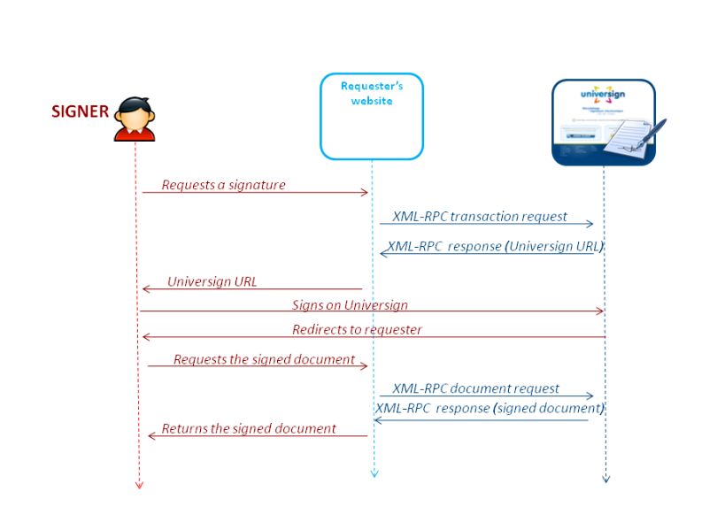

Symfony Bundle to quickly interact with Universign library
=================================================

Installation:
-------------

To install this bundle, simply run the following command:
```bash
$ composer require mpp/universign-bundle
```


How to run:
-----------

Before run, you need to add `UNIVERSIGN_ENTRYPOINT_URL` variable in the `.env` file of your project with the url and the credentials of the universign account.

```
###> mpp/unviversign-bundle ###
UNIVERSIGN_ENTRYPOINT_URL=https://<LOGIN>:<PASSWORD>@sign.test.cryptolog.com/sign/rpc/
###< mpp/unviversign-bundle ###
```

After this you can use this bundle with your Symfony Project.

How to use:
-----------

Here is a presentation of the Universign workflow:



### Requests a signature

First, you have to send a transaction to Universign services.

#### Transaction Request

Here is an example:

```php
...
use Mpp\UniversignBundle\Requester\RequesterInterface;

...
/**
 * @var RequesterInterface;
 */
private $requester;

public function __construct(RequesterInterface $requester)
{
    $this->requester = $requester;
}

...
    $transaction = $this->requester->initiateTransaction();

    $signer = Signer::createFromArray([
        'firstname' => 'john',
        'lastname' => 'doe',
        'organization' => 'dummy company',
        'emailAddress' => 'john.doe@dummy-company.com',
        'phoneNum' => '+0122334455',
        'language' => 'fr',
        'role' => \Mpp\UniversignBundle\Model\Signer::ROLE_SIGNER,
        'birthDate' => new \DateTime::createFromFormat('Y-m-d', '2000-01-01'),
        'certificateType' =>  \Mpp\UniversignBundle\Model\CertificateType::SIMPLE,
    ]);

    $document = Document::createFromArray([
        'documentType' => 'pdf',
        'fileName' => 'contract_test.pdf',
        'signatureField' => [
            'name' => 'Client:',
            'page' => 2,
            'signerIndex' => 0,
        ],
    ]);

    $transaction
        ->addSigner($signer)
        ->addDocument($document)
        ->setProfile('test')
        ->setCustomId('Universign-0001')
        ->setMustContactFirstSigner(true)
        ->setFinalDocSent(true)
        ->setFinalDocRequesterSent(true)
        ->setFinalDocObserverSent(false)
        ->setDescription('this is an example')
        ->setCertificateType('simple')
        ->setLanguage('en')
        ->setHandwrittenSignatureMode(1)
        ->setChainingMode('email')
        ->setFinalDocCCeMails(true)
        ->setRedirectPolicy('dashboard')
    ;

    $transactionResponse = $this->requester->requestTransaction($transaction);
```
Once you have send the request transaction, you will get a `TransactionResponse` object in which you will find the transaction ID and an URL.

#### Transaction Response

Here is an example of the `TransactionResponse` object:
 ```php
{
  'id' => "bde1e661-a217-4d2b-a3ec-160c2e266ff4"
  'url' => "https://sign.test.universign.eu/sig/#/?id=7d161638-9fb7-42c9-bb56-c902ea491404"
}
 ```
The `id` value identify the transaction, it allow you to get more information about the transaction, retrieve the signed documents.
The `url` value is used to sign the documents by the signers.

### Requests the signed document

After you have send your transaction request and it has been signed, send a request to get the signed documents with the previous transaction id:

```php
$documents = $this->requester->getDocuments($transactionId);
```
You will get an array of `Document` object:

```php
[
    0 => [
        'id' => 'http.example.com',
        'documentType' => 'pdf',
        'content' => "JVBERi0xLj[...]UKJb4",
        'fileName' => 'contract_test',
        'signatureFields' => [
            [
                'name' => 'Client:',
                'page' => 1,
                'x' => 100,
                'y' =>  200,
                'signerIndex' => 0,
            ],
        ]
        'checkBoxTexts' => null,
        'metaData' => null,
        'title' => null,
        'sepaData' => [
            'rum' => '87654345678765'
            'ics' => 'FR12ZZZ123456'
            'iban' => 'FR7630006000011234567890189'
            'bic' => 'BREDFRPPXXX'
            'recuring' => false
            'debtor' => [
                'name' => 'Victor Vidal'
                'address' => '805, boulevard Richard'
                'postalCode' => '32 082'
                'city' => 'Ruiz-sur-Dos Santos'
                'country' => 'Christmas (Île)'
            ]
        ]
        'creditor' => [
            'name' => 'Marie Pierre'
            'address' => 'rue Roger Marie'
            'postalCode' => '71 625'
            'city' => 'Deschamps-sur-Dupre'
            'country' => 'Bosnie-Herzégovine'
        ]
    ]
]
```

The `content` parameters is your signed document base64 encoded. Simply decode it to get the file.

More Informations:
------------------

 - Advanced documentation:
   - [TransactionInfo](./Resources/docs/TransactionInfo.md)
   - [TransactionFilter](./Resources/docs/TransactionFilter.md)
   - [RelaunchTransaction](./Resources/docs/RelaunchTransaction.md)
   - [CancelTransaction](./Resources/docs/CancelTransaction.md)
 - Object Structure:
   - [Signer](./Resources/docs/Signer.md)
   - [Document](./Resources/docs/Document.md)
   - [SignatureField](./Resources/docs/SignatureField.md)
 - Others:
   - [Universign documentation](https://help.universign.com/hc/fr/articles/360000837769-Guide-API-Universign)


